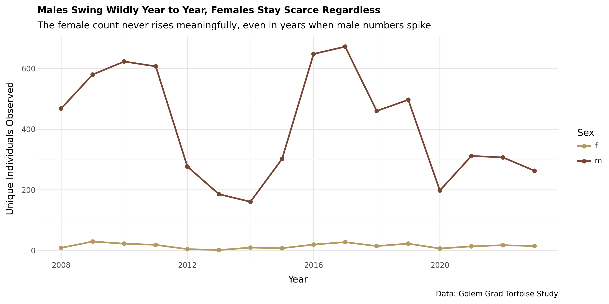
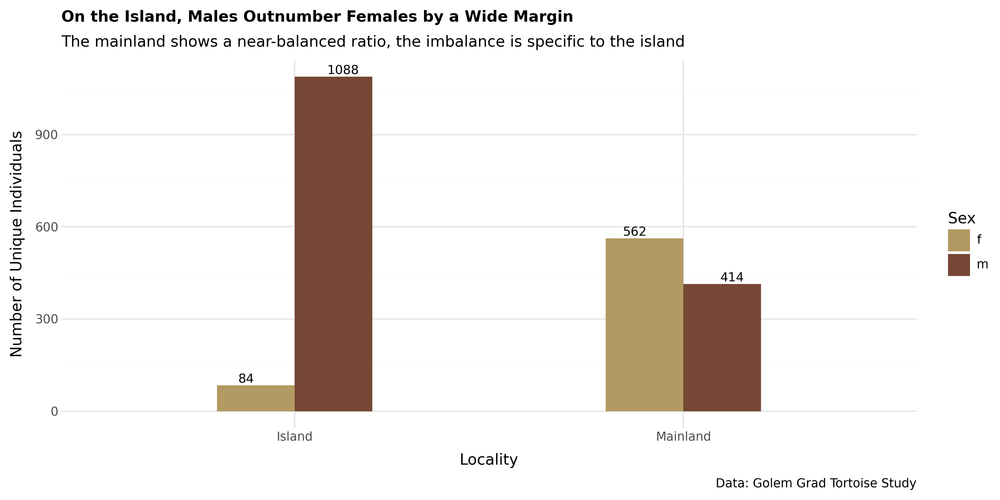
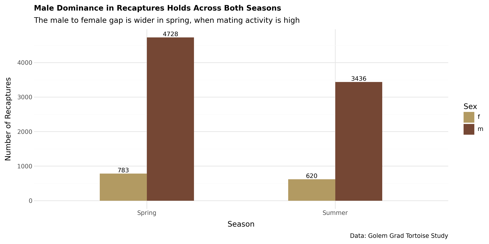
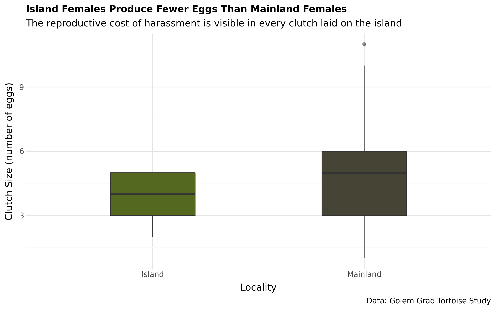
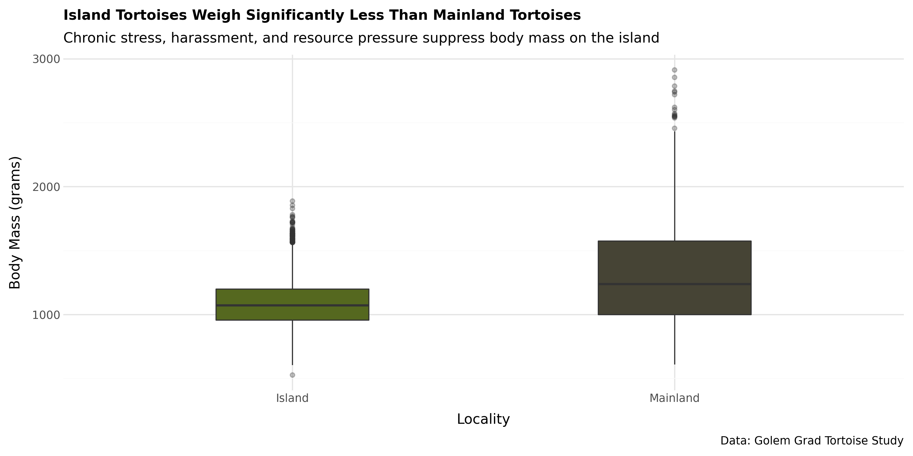
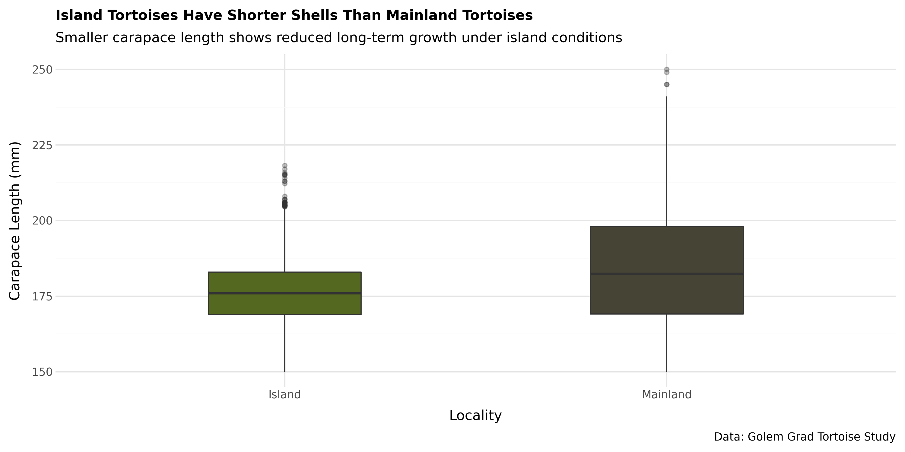
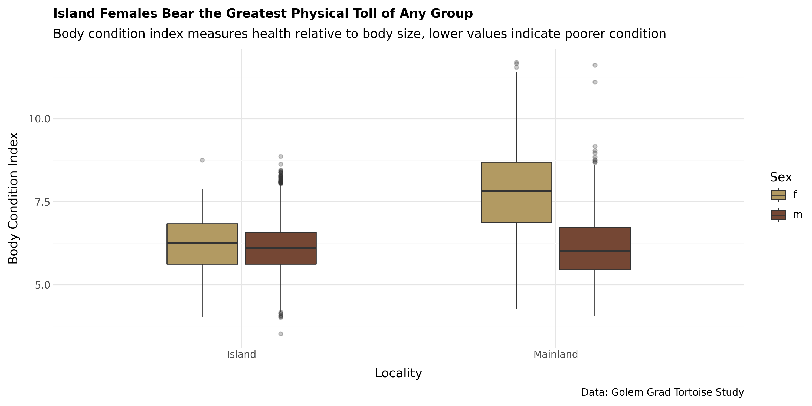
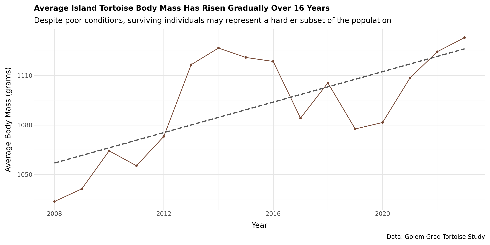
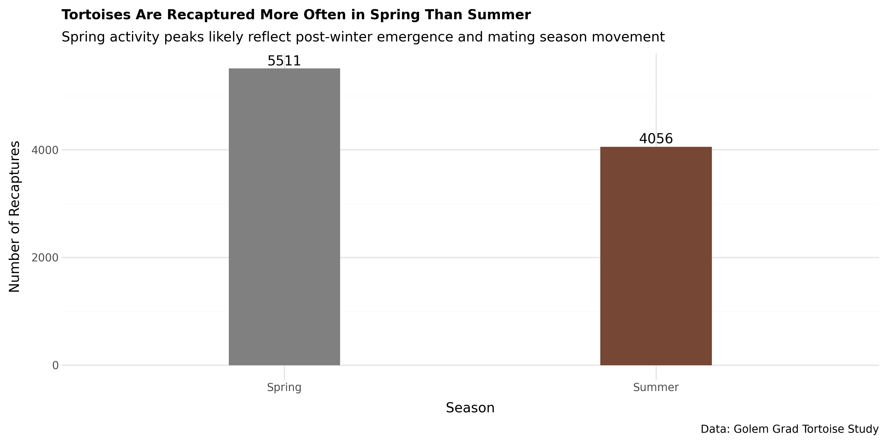
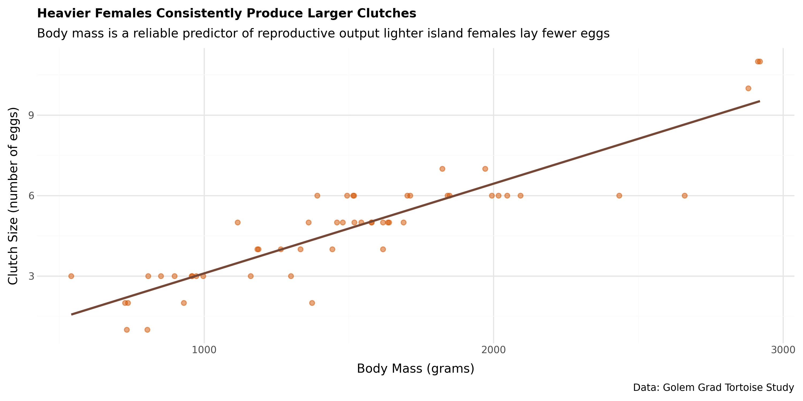

# Exploratory Data Analysis of the Golem Grad Tortoise Population

---

In 2007, a team of ecologists set up camp on a small uninhabited island in Lake Prespa, North Macedonia. Golem Grad. Snake Island. A protected nature reserve accessible only by boat.

They came to study population dynamics. Tortoises, dice snakes, horn-nosed vipers. Standard long-term ecological fieldwork. Mark individuals, recapture them, measure them, record data. They expected to build a demographic picture.

What they found instead was something no ecologist had ever documented in a wild population.

**The tortoises were walking off cliffs.**

*Male counts on the island swing dramatically year to year. Female counts stay consistently low throughout, never rising meaningfully even when male numbers spike.*

---

Not occasionally. Not randomly. Female tortoises, specifically, were approaching the edge and not stopping. One GPS-monitored female recorded a sudden acceleration just before going over. Her shell hit the rocks with fractures. Researchers at first recorded these as accidents. Then the pattern became impossible to ignore.

They looked harder. And what they saw was this: on the island, males outnumber females by nearly **13 to 1.**

*1,088 males to 84 females on the island. On the mainland, the ratio is nearly balanced. The imbalance is specific to Golem Grad.*

---

## The Violence Hiding in Plain Sight

Male Hermann's tortoises are not gentle suitors. In a balanced population, their aggression is normal; they ram, bite, and pursue females until mating occurs. On a normal day, in a normal population, a female can avoid, rest, and forage.

On Golem Grad, there is no normal day.

Three-quarters of island females had injury marks on their reproductive organs from forced copulations. Males were observed forming piles, mounting each other to reach the female trapped at the bottom. When females fled, the males followed. When females reached the cliff edge, they kept going.

*Males dominate recapture counts in both seasons and the gap is widest in spring, when mating activity peaks.*

---

## Is It Psychological?

This is the question that haunts the data.

Tortoises are not mammals. They do not process trauma the way humans do. But a 2025 paper studying these same females found that chronic coercive mating measurably altered their personality traits, their behaviour, their responses, their choices. They had changed.

The harassment is not just physical. Researchers noted the females' mental state was disturbed. X-rays showed that only 15% of island females carried eggs. Most had empty abdominal cavities. They were not just injured. They had stopped trying to reproduce.

*Island females lay fewer eggs on average than mainland females. The island sample is small, just 9 recorded clutches, but the gap lines up with everything else in the data.*

---

## What the Data Says

This is where 16 years of capture-recapture data become more than numbers.

Every row in this dataset is a tortoise that was caught, measured, weighed, and released. Over 1,800 individuals. Nearly 16,000 recapture events. And threaded through all of it, if you know where to look, is the signal of a population under pressure.

**Island tortoises weigh less.**

*Island tortoises carry significantly lower body mass than their mainland counterparts.*

**Their shells are shorter.**

*A shorter carapace reflects slower long-term growth under island conditions.*

**And island life itself, not sex specifically, appears to suppress body condition.**

*Mainland females have the best body condition of any group by a wide margin. Island females and island males are statistically close to each other, both well below mainland females. The island environment is hard on both sexes, not just females.*

Their clutches are smaller. And the sex ratio imbalance shows no sign of correcting itself, year after year, regardless of how male numbers fluctuate.

The average body mass of island tortoises has risen slightly over 16 years. That sounds like good news. **It isn't.** It is survivorship bias the weakest individuals are already gone. What remains is a small, hardy, increasingly lonely remnant.

*A rising trend line that, in this context, is a warning sign rather than good news.*

---

## How Did It Get This Way?

Nobody knows for certain. The oldest males on the island have human engravings on their shells, a sign they may have been kept as pets or livestock, introduced by the monastic community that once lived on the island before leaving in the mid-20th century. If those original tortoises were introduced with an already uneven sex ratio, the island was a slow-motion crisis from the beginning.

A self-reinforcing extinction vortex: fewer females means more proportional pressure per female. More pressure kills more females. Fewer females means more pressure. There is no natural exit from this loop.

*Breaking locality down further complicates the simple island-versus-mainland story. Beach, a mainland site, actually has the lowest median body condition of all three locations. Konjsko, also mainland, has the highest. Body condition here isn't explained by island status alone, something specific to each site matters too.*

---

## What Can Be Done?

The answer is not complicated. Introduce more females with a female-biased ratio.  Conservation reintroduction programmes for Hermann's tortoises in Western Europe already do this routinely.

What is needed is political will, resources, and speed. The projection says 2083. That feels far away. But Hermann's tortoises take 10–15 years to reach sexual maturity. Any intervention needs to start now to have offspring ready in time.

*Heavier females consistently lay more eggs the quantitative case for why healthier, better-fed females matter for recovery.*

---

## Why This Project Matters to Me

I work with numbers and charts and models. But this project reminded me that behind every dataset is something that actually happened.

Those 15,995 recapture events in this dataset are real encounters. A researcher on a small island in a lake, in the early spring, catching a tortoise that has been caught before, measuring it, and letting it go. Building a record, year by year, of a population under pressure.

The data did not always confirm what I expected it to. Some patterns were sharper than the published narrative suggested. Others were more complicated, or pointed somewhere slightly different. That, too, is part of what this project taught me: the discipline of letting the data say what it actually says, even when it's not the cleanest story.

> As a result of this analysis, the physical and reproductive toll of an extreme sex ratio imbalance on the Golem Grad tortoise population was quantified across 16 years of data  demonstrating a persistent 13-to-1 male-to-female ratio on the island, reduced body mass and carapace length compared to the mainland, and a measurable reproductive cost, consistent with the study's projected population collapse by 2083.

**The last female on the island will die in 2083.**

Unless we do something about it.

---

## Datasets

| File | Rows | Description |
|---|---|---|
| `tortoise_body_condition.csv` | ~10,174 | Individual body measurements, season, sex, locality, body condition index |
| `clutch_size.csv` | ~59 | Egg clutch records, with age and body mass. No `sex` column exists; every record is assumed female since only females lay eggs |

## Tools & Libraries

Python · pandas · plotnine (ggplot2-style visualization) · pyjanitor · NumPy

## Data Source

Golem Grad Hermann's Tortoise Capture–Recapture Study
*"Sex Ratio Bias Triggers Demographic Suicide in a Dense Tortoise Population"*  Arsovski et al., *Ecology Letters*, 2026
